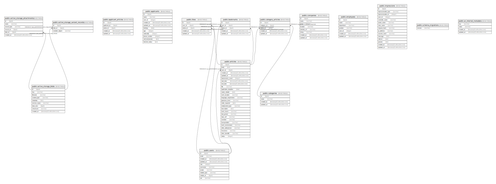

# my_proj_development

## Tables

| Name | Columns | Comment | Type |
| ---- | ------- | ------- | ---- |
| [public.active_storage_attachments](public.active_storage_attachments.md) | 6 |  | BASE TABLE |
| [public.active_storage_blobs](public.active_storage_blobs.md) | 9 |  | BASE TABLE |
| [public.active_storage_variant_records](public.active_storage_variant_records.md) | 3 |  | BASE TABLE |
| [public.articles](public.articles.md) | 9 | articles table | BASE TABLE |
| [public.bookmarks](public.bookmarks.md) | 5 |  | BASE TABLE |
| [public.categories](public.categories.md) | 4 |  | BASE TABLE |
| [public.category_articles](public.category_articles.md) | 5 |  | BASE TABLE |
| [public.impressions](public.impressions.md) | 15 |  | BASE TABLE |
| [public.likes](public.likes.md) | 5 |  | BASE TABLE |
| [public.people](public.people.md) | 5 | 日記に出てきた登場人物 | BASE TABLE |
| [public.person_articles](public.person_articles.md) | 5 |  | BASE TABLE |
| [public.users](public.users.md) | 11 | 日記を書くユーザー | BASE TABLE |
| [public.schema_migrations](public.schema_migrations.md) | 1 |  | BASE TABLE |
| [public.ar_internal_metadata](public.ar_internal_metadata.md) | 4 |  | BASE TABLE |

## Relations

---

> Generated by [tbls](https://github.com/k1LoW/tbls)
