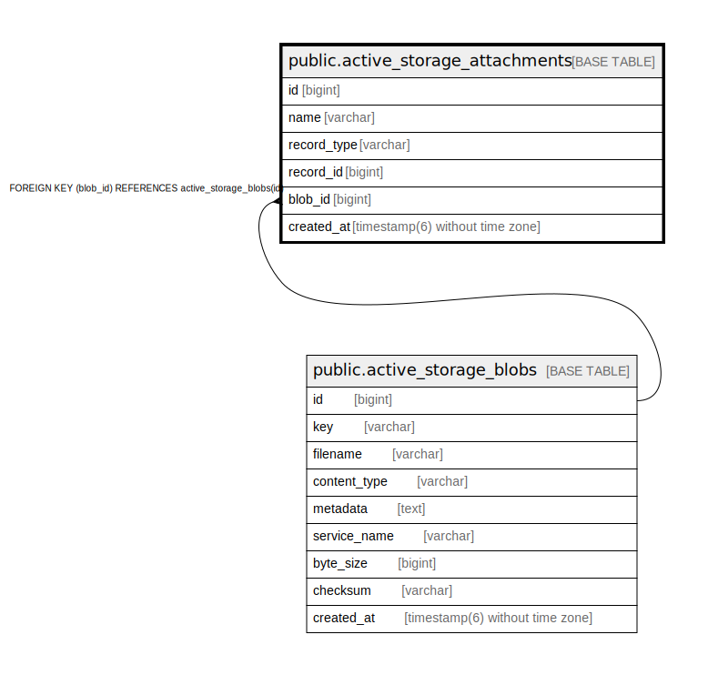

# public.active_storage_attachments

## Description

ActiveStorageの添付ファイルの関連付けテーブル

## Columns

| Name | Type | Default | Nullable | Children | Parents | Comment |
| ---- | ---- | ------- | -------- | -------- | ------- | ------- |
| id | bigint | nextval('active_storage_attachments_id_seq'::regclass) | false |  |  |  |
| name | varchar |  | false |  |  | 添付の名前 |
| record_type | varchar |  | false |  |  | 添付されているレコードの型 |
| record_id | bigint |  | false |  |  | 添付されているレコードのID |
| blob_id | bigint |  | false |  | [public.active_storage_blobs](public.active_storage_blobs.md) | 添付のblobへの参照ID |
| created_at | timestamp(6) without time zone |  | false |  |  | 作成日時 |

## Constraints

| Name | Type | Definition |
| ---- | ---- | ---------- |
| fk_rails_c3b3935057 | FOREIGN KEY | FOREIGN KEY (blob_id) REFERENCES active_storage_blobs(id) |
| active_storage_attachments_pkey | PRIMARY KEY | PRIMARY KEY (id) |

## Indexes

| Name | Definition |
| ---- | ---------- |
| active_storage_attachments_pkey | CREATE UNIQUE INDEX active_storage_attachments_pkey ON public.active_storage_attachments USING btree (id) |
| index_active_storage_attachments_on_blob_id | CREATE INDEX index_active_storage_attachments_on_blob_id ON public.active_storage_attachments USING btree (blob_id) |
| index_active_storage_attachments_uniqueness | CREATE UNIQUE INDEX index_active_storage_attachments_uniqueness ON public.active_storage_attachments USING btree (record_type, record_id, name, blob_id) |

## Relations

---

> Generated by [tbls](https://github.com/k1LoW/tbls)
