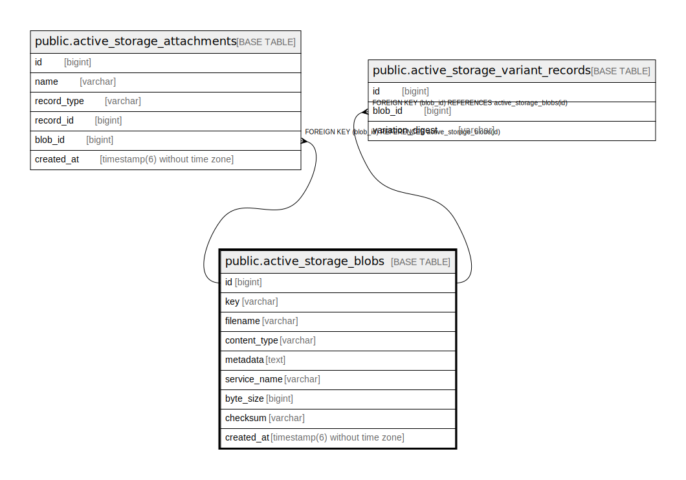

# public.active_storage_blobs

## Description

ActiveStorageのblobテーブル

## Columns

| Name | Type | Default | Nullable | Children | Parents | Comment |
| ---- | ---- | ------- | -------- | -------- | ------- | ------- |
| id | bigint | nextval('active_storage_blobs_id_seq'::regclass) | false | [public.active_storage_attachments](public.active_storage_attachments.md) [public.active_storage_variant_records](public.active_storage_variant_records.md) |  |  |
| key | varchar |  | false |  |  | blobのキー |
| filename | varchar |  | false |  |  | ファイル名 |
| content_type | varchar |  | true |  |  | コンテンツタイプ |
| metadata | text |  | true |  |  | メタデータ |
| service_name | varchar |  | false |  |  | サービス名 |
| byte_size | bigint |  | false |  |  | バイトサイズ |
| checksum | varchar |  | true |  |  | チェックサム |
| created_at | timestamp(6) without time zone |  | false |  |  | 作成日時 |

## Constraints

| Name | Type | Definition |
| ---- | ---- | ---------- |
| active_storage_blobs_pkey | PRIMARY KEY | PRIMARY KEY (id) |

## Indexes

| Name | Definition |
| ---- | ---------- |
| active_storage_blobs_pkey | CREATE UNIQUE INDEX active_storage_blobs_pkey ON public.active_storage_blobs USING btree (id) |
| index_active_storage_blobs_on_key | CREATE UNIQUE INDEX index_active_storage_blobs_on_key ON public.active_storage_blobs USING btree (key) |

## Relations

---

> Generated by [tbls](https://github.com/k1LoW/tbls)
