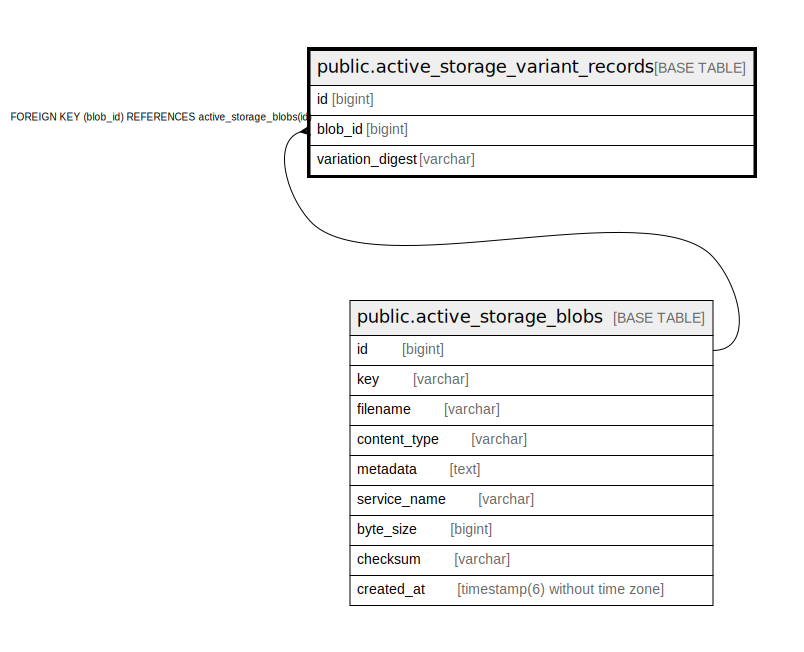

# public.active_storage_variant_records

## Description

## Columns

| Name | Type | Default | Nullable | Children | Parents | Comment |
| ---- | ---- | ------- | -------- | -------- | ------- | ------- |
| id | bigint | nextval('active_storage_variant_records_id_seq'::regclass) | false |  |  |  |
| blob_id | bigint |  | false |  | [public.active_storage_blobs](public.active_storage_blobs.md) |  |
| variation_digest | varchar |  | false |  |  |  |

## Constraints

| Name | Type | Definition |
| ---- | ---- | ---------- |
| fk_rails_993965df05 | FOREIGN KEY | FOREIGN KEY (blob_id) REFERENCES active_storage_blobs(id) |
| active_storage_variant_records_pkey | PRIMARY KEY | PRIMARY KEY (id) |

## Indexes

| Name | Definition |
| ---- | ---------- |
| active_storage_variant_records_pkey | CREATE UNIQUE INDEX active_storage_variant_records_pkey ON public.active_storage_variant_records USING btree (id) |
| index_active_storage_variant_records_uniqueness | CREATE UNIQUE INDEX index_active_storage_variant_records_uniqueness ON public.active_storage_variant_records USING btree (blob_id, variation_digest) |

## Relations

---

> Generated by [tbls](https://github.com/k1LoW/tbls)
