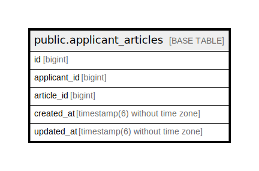

# public.applicant_articles

## Description

求職者と求人記事の関連付けテーブル

## Columns

| Name | Type | Default | Nullable | Children | Parents | Comment |
| ---- | ---- | ------- | -------- | -------- | ------- | ------- |
| id | bigint | nextval('applicant_articles_id_seq'::regclass) | false |  |  |  |
| applicant_id | bigint |  | true |  |  | 求職者のID |
| article_id | bigint |  | true |  |  | 求人記事のID |
| created_at | timestamp(6) without time zone |  | false |  |  | 作成日時 |
| updated_at | timestamp(6) without time zone |  | false |  |  | 更新日時 |

## Constraints

| Name | Type | Definition |
| ---- | ---- | ---------- |
| applicant_articles_pkey | PRIMARY KEY | PRIMARY KEY (id) |

## Indexes

| Name | Definition |
| ---- | ---------- |
| applicant_articles_pkey | CREATE UNIQUE INDEX applicant_articles_pkey ON public.applicant_articles USING btree (id) |

## Relations

---

> Generated by [tbls](https://github.com/k1LoW/tbls)
