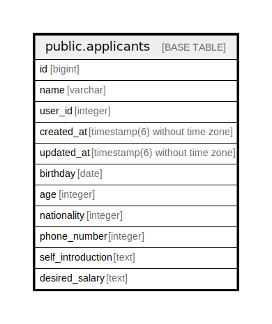

# public.applicants

## Description

求職者テーブル

## Columns

| Name | Type | Default | Nullable | Children | Parents | Comment |
| ---- | ---- | ------- | -------- | -------- | ------- | ------- |
| id | bigint | nextval('applicants_id_seq'::regclass) | false | [public.applicant_articles](public.applicant_articles.md) |  |  |
| name | varchar |  | false |  |  | 求職者の名前 |
| user_id | integer |  | true |  |  | この求職者がアプリのユーザーである場合のID |
| created_at | timestamp(6) without time zone |  | false |  |  | 作成日時 |
| updated_at | timestamp(6) without time zone |  | false |  |  | 更新日時 |
| birthday | date |  | true |  |  |  |
| age | integer |  | true |  |  |  |
| nationality | integer |  | true |  |  |  |
| phone_number | integer |  | true |  |  |  |
| self_introduction | text |  | true |  |  |  |
| desired_salary | text |  | true |  |  |  |

## Constraints

| Name | Type | Definition |
| ---- | ---- | ---------- |
| applicants_pkey | PRIMARY KEY | PRIMARY KEY (id) |

## Indexes

| Name | Definition |
| ---- | ---------- |
| applicants_pkey | CREATE UNIQUE INDEX applicants_pkey ON public.applicants USING btree (id) |

## Relations

---

> Generated by [tbls](https://github.com/k1LoW/tbls)
