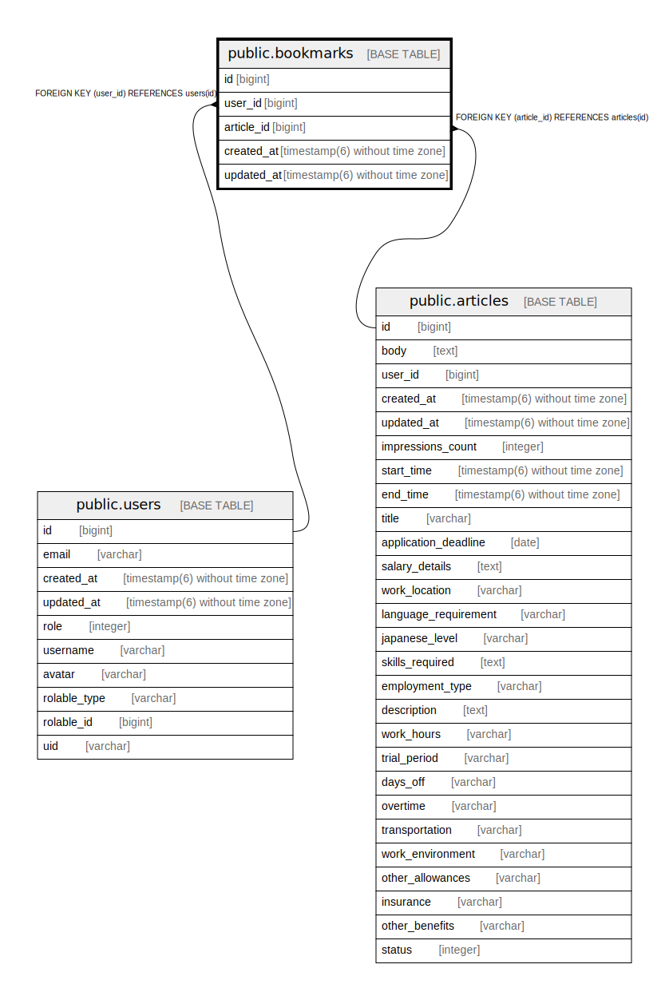

# public.bookmarks

## Description

ユーザーがブックマークした記事のテーブル

## Columns

| Name | Type | Default | Nullable | Children | Parents | Comment |
| ---- | ---- | ------- | -------- | -------- | ------- | ------- |
| id | bigint | nextval('bookmarks_id_seq'::regclass) | false |  |  |  |
| user_id | bigint |  | false |  | [public.users](public.users.md) | ブックマークしたユーザーのID |
| article_id | bigint |  | false |  | [public.articles](public.articles.md) | ブックマークされた記事のID |
| created_at | timestamp(6) without time zone |  | false |  |  | 作成日時 |
| updated_at | timestamp(6) without time zone |  | false |  |  | 更新日時 |

## Constraints

| Name | Type | Definition |
| ---- | ---- | ---------- |
| fk_rails_f21f0eaac1 | FOREIGN KEY | FOREIGN KEY (article_id) REFERENCES articles(id) |
| bookmarks_pkey | PRIMARY KEY | PRIMARY KEY (id) |
| fk_rails_c1ff6fa4ac | FOREIGN KEY | FOREIGN KEY (user_id) REFERENCES users(id) |

## Indexes

| Name | Definition |
| ---- | ---------- |
| bookmarks_pkey | CREATE UNIQUE INDEX bookmarks_pkey ON public.bookmarks USING btree (id) |
| index_bookmarks_on_article_id | CREATE INDEX index_bookmarks_on_article_id ON public.bookmarks USING btree (article_id) |
| index_bookmarks_on_user_id | CREATE INDEX index_bookmarks_on_user_id ON public.bookmarks USING btree (user_id) |

## Relations

---

> Generated by [tbls](https://github.com/k1LoW/tbls)
