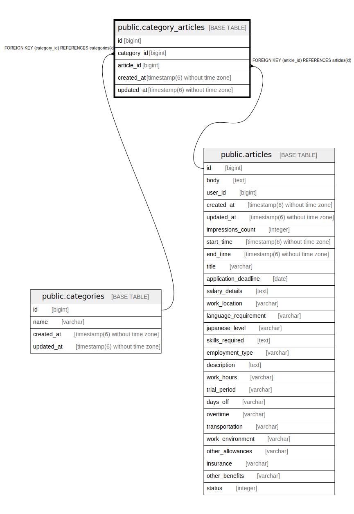

# public.category_articles

## Description

## Columns

| Name | Type | Default | Nullable | Children | Parents | Comment |
| ---- | ---- | ------- | -------- | -------- | ------- | ------- |
| id | bigint | nextval('category_articles_id_seq'::regclass) | false |  |  |  |
| category_id | bigint |  | false |  | [public.categories](public.categories.md) |  |
| article_id | bigint |  | false |  | [public.articles](public.articles.md) |  |
| created_at | timestamp(6) without time zone |  | false |  |  |  |
| updated_at | timestamp(6) without time zone |  | false |  |  |  |

## Constraints

| Name | Type | Definition |
| ---- | ---- | ---------- |
| fk_rails_18c68751f6 | FOREIGN KEY | FOREIGN KEY (article_id) REFERENCES articles(id) |
| fk_rails_fd16bee33c | FOREIGN KEY | FOREIGN KEY (category_id) REFERENCES categories(id) |
| category_articles_pkey | PRIMARY KEY | PRIMARY KEY (id) |

## Indexes

| Name | Definition |
| ---- | ---------- |
| category_articles_pkey | CREATE UNIQUE INDEX category_articles_pkey ON public.category_articles USING btree (id) |
| index_category_articles_on_article_id | CREATE INDEX index_category_articles_on_article_id ON public.category_articles USING btree (article_id) |
| index_category_articles_on_category_id | CREATE INDEX index_category_articles_on_category_id ON public.category_articles USING btree (category_id) |

## Relations

---

> Generated by [tbls](https://github.com/k1LoW/tbls)
