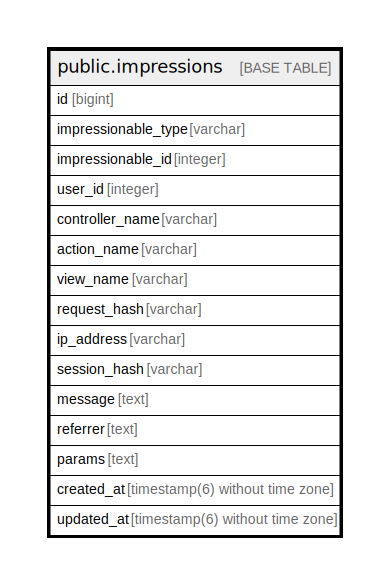

# public.impressions

## Description

インプレッションのテーブル

## Columns

| Name | Type | Default | Nullable | Children | Parents | Comment |
| ---- | ---- | ------- | -------- | -------- | ------- | ------- |
| id | bigint | nextval('impressions_id_seq'::regclass) | false |  |  |  |
| impressionable_type | varchar |  | true |  |  | インプレッションを持つオブジェクトの型 |
| impressionable_id | integer |  | true |  |  | インプレッションを持つオブジェクトのID |
| user_id | integer |  | true |  |  | インプレッションを持つユーザーのID |
| controller_name | varchar |  | true |  |  | コントローラ名 |
| action_name | varchar |  | true |  |  | アクション名 |
| view_name | varchar |  | true |  |  | ビュー名 |
| request_hash | varchar |  | true |  |  | リクエストハッシュ |
| ip_address | varchar |  | true |  |  | IPアドレス |
| session_hash | varchar |  | true |  |  | セッションハッシュ |
| message | text |  | true |  |  | メッセージ |
| referrer | text |  | true |  |  | 参照元 |
| params | text |  | true |  |  | パラメータ |
| created_at | timestamp(6) without time zone |  | false |  |  | 作成日時 |
| updated_at | timestamp(6) without time zone |  | false |  |  | 更新日時 |

## Constraints

| Name | Type | Definition |
| ---- | ---- | ---------- |
| impressions_pkey | PRIMARY KEY | PRIMARY KEY (id) |

## Indexes

| Name | Definition |
| ---- | ---------- |
| impressions_pkey | CREATE UNIQUE INDEX impressions_pkey ON public.impressions USING btree (id) |
| controlleraction_ip_index | CREATE INDEX controlleraction_ip_index ON public.impressions USING btree (controller_name, action_name, ip_address) |
| controlleraction_request_index | CREATE INDEX controlleraction_request_index ON public.impressions USING btree (controller_name, action_name, request_hash) |
| controlleraction_session_index | CREATE INDEX controlleraction_session_index ON public.impressions USING btree (controller_name, action_name, session_hash) |
| poly_ip_index | CREATE INDEX poly_ip_index ON public.impressions USING btree (impressionable_type, impressionable_id, ip_address) |
| poly_params_request_index | CREATE INDEX poly_params_request_index ON public.impressions USING btree (impressionable_type, impressionable_id, params) |
| poly_request_index | CREATE INDEX poly_request_index ON public.impressions USING btree (impressionable_type, impressionable_id, request_hash) |
| poly_session_index | CREATE INDEX poly_session_index ON public.impressions USING btree (impressionable_type, impressionable_id, session_hash) |
| impressionable_type_message_index | CREATE INDEX impressionable_type_message_index ON public.impressions USING btree (impressionable_type, message, impressionable_id) |
| index_impressions_on_user_id | CREATE INDEX index_impressions_on_user_id ON public.impressions USING btree (user_id) |

## Relations

---

> Generated by [tbls](https://github.com/k1LoW/tbls)
