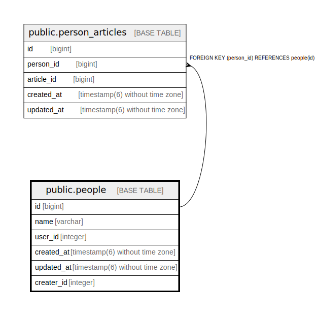

# public.people

## Description

日記に登場する人物情報テーブル

## Columns

| Name | Type | Default | Nullable | Children | Parents | Comment |
| ---- | ---- | ------- | -------- | -------- | ------- | ------- |
| id | bigint | nextval('people_id_seq'::regclass) | false | [public.person_articles](public.person_articles.md) |  |  |
| name | varchar |  | false |  |  | 人物の名前 |
| user_id | integer |  | true |  |  | この人物がアプリのユーザーである場合のID |
| created_at | timestamp(6) without time zone |  | false |  |  | 作成日時 |
| updated_at | timestamp(6) without time zone |  | false |  |  | 更新日時 |
| creater_id | integer |  | false |  |  | この人物を作成したユーザーのID |

## Constraints

| Name | Type | Definition |
| ---- | ---- | ---------- |
| people_pkey | PRIMARY KEY | PRIMARY KEY (id) |

## Indexes

| Name | Definition |
| ---- | ---------- |
| people_pkey | CREATE UNIQUE INDEX people_pkey ON public.people USING btree (id) |

## Relations

---

> Generated by [tbls](https://github.com/k1LoW/tbls)
