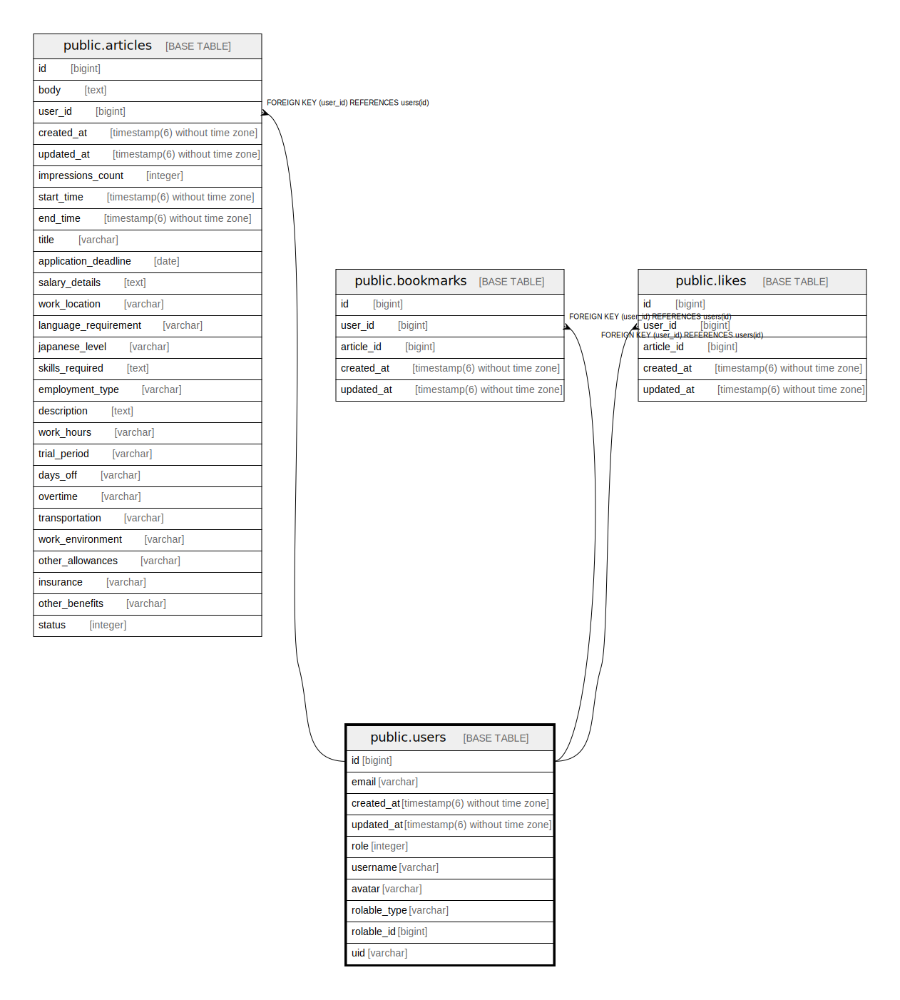

# public.users

## Description

日記を書くユーザー

## Columns

| Name | Type | Default | Nullable | Children | Parents | Comment |
| ---- | ---- | ------- | -------- | -------- | ------- | ------- |
| id | bigint | nextval('users_id_seq'::regclass) | false | [public.articles](public.articles.md) [public.bookmarks](public.bookmarks.md) [public.likes](public.likes.md) |  |  |
| email | varchar | ''::character varying | false |  |  |  |
| encrypted_password | varchar | ''::character varying | false |  |  |  |
| reset_password_token | varchar |  | true |  |  |  |
| reset_password_sent_at | timestamp(6) without time zone |  | true |  |  |  |
| remember_created_at | timestamp(6) without time zone |  | true |  |  |  |
| created_at | timestamp(6) without time zone |  | false |  |  |  |
| updated_at | timestamp(6) without time zone |  | false |  |  |  |
| avatar | varchar |  | true |  |  |  |
| username | varchar |  | false |  |  | 日記を書くユーザーの名前 |
| default_color | varchar | 'blue'::character varying | true |  |  |  |

## Constraints

| Name | Type | Definition |
| ---- | ---- | ---------- |
| users_pkey | PRIMARY KEY | PRIMARY KEY (id) |

## Indexes

| Name | Definition |
| ---- | ---------- |
| users_pkey | CREATE UNIQUE INDEX users_pkey ON public.users USING btree (id) |
| index_users_on_email | CREATE UNIQUE INDEX index_users_on_email ON public.users USING btree (email) |
| index_users_on_reset_password_token | CREATE UNIQUE INDEX index_users_on_reset_password_token ON public.users USING btree (reset_password_token) |
| index_users_on_username | CREATE UNIQUE INDEX index_users_on_username ON public.users USING btree (username) |

## Relations

---

> Generated by [tbls](https://github.com/k1LoW/tbls)
